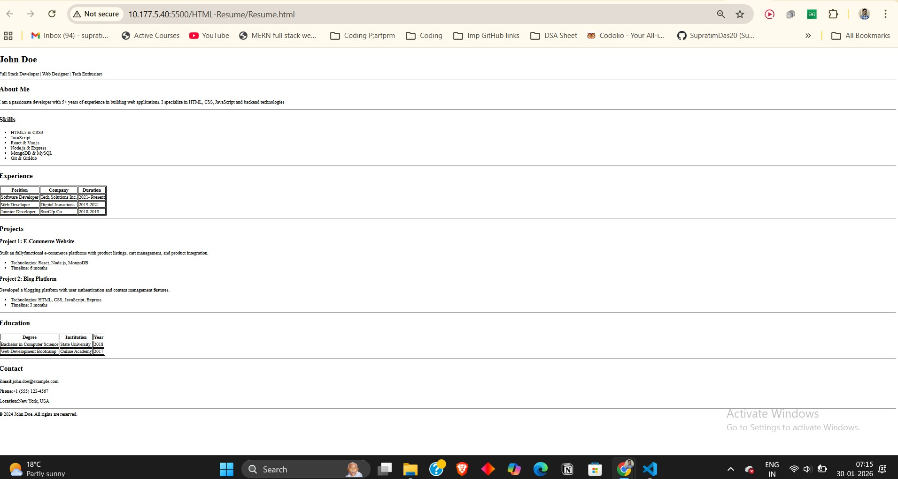

# 📄 Single-Page Resume Website (HTML Only)

##  Project Overview

This project is a **single-page resume website** built using ** HTML**, CSS.
The goal of this assignment is to demonstrate a strong understanding of **HTML structure, semantics, and layout organization**.

The resume is structured to closely match the provided reference layout and includes all essential resume sections such as personal details, skills, experience, projects, education, and contact information.

---

## 🛠️ Technologies Used

* **HTML5**
---

## 🧱 Sections Included

The resume contains the following sections:

* **Header / Name**
* **About Me**
* **Skills** (unordered list)
* **Experience** (table format)
* **Projects**
* **Education** (table format)
* **Contact Details**
* **Footer**

Each section uses appropriate HTML elements such as:

* `<header>`, `<section>`, `<footer>`
* `<h1>` to `<h3>`
* `<p>`, `<ul>`, `<li>`
* `<table>`, `<tr>`, `<th>`, `<td>`

---

## ▶️ How to Run the Project

1. Clone the repository:

   ```bash
   git clone https://github.com/SupratimDas20/HTML-Learning.git
   ```

2. Navigate to the project folder:

   ```bash
   cd HTML-Learning
   ```

3. Open the file:

   * Double-click `Resume.html`
     **OR**
   * Right-click → Open with browser (Chrome / Edge / Firefox)

---

## 🖼️ Demo & Output


